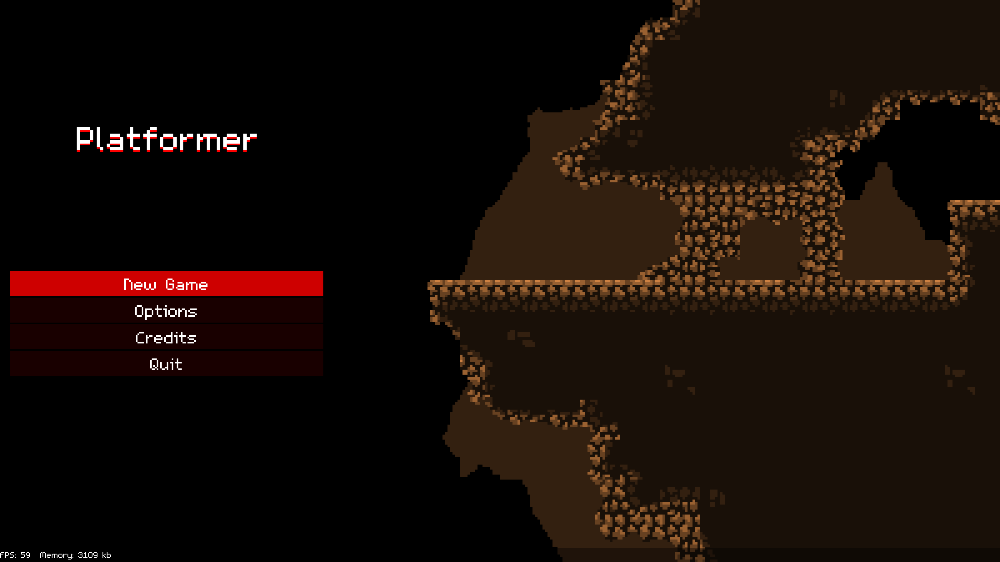
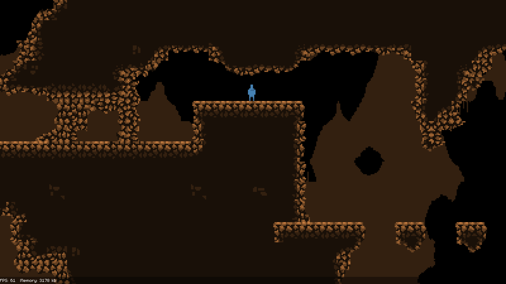

# Generic Platformer Example

A short game built in [LÖVE][love] built as an example.

<!-- MarkdownTOC autolink="true" -->

- [Gameplay](#gameplay)
- [Screenshots](#screenshots)
- [Overview](#overview)
  - [Game Fundamentals](#game-fundamentals)
  - [Squeak Fundamentals](#squeak-fundamentals)
    - [`GameObject`](#gameobject)
    - [`Component`](#component)
    - [`GobsList`](#gobslist)
    - [`EventEmitter`](#eventemitter)
    - [`SceneManager` and `Scene`](#scenemanager-and-scene)
  - [Squeak Freebies](#squeak-freebies)
    - [`StateMachine` and `State`](#statemachine-and-state)
    - [`Coroutine` and `CoroutineList`](#coroutine-and-coroutinelist)
  - [Squick Fundamentals](#squick-fundamentals)
    - [`Control`](#control)
      - [Layout](#layout)
    - [`Context`](#context)

<!-- /MarkdownTOC -->


## Gameplay

The game is drop-dead simple. There's a main menu. Selecting "New Game" starts the first level. The player will die if they fall. The player can pick up a sword.

There's no end. Just quit.

Controls are WASD, arrow keys, and gamepad. Jump might be the spacebar or a gamepad button. The "action" key is Z or a different gamepad button.

## Screenshots





## Overview

I feel like this is a good starting point for a LÖVE game. If you disagree, please open an issue and explain why and hopefully I'll learn something in the process.

### Game Fundamentals

Start in [main.lua][main].

  * It creates an `EventEmitter` instance, used by basically everything in the game.
  * It creates a `Registry` of services. That `Registry` makes me feel better about having what is basically a god object in my game, which I don't like.
  * It creates the `Camera` instance.
  * It creates the `SceneManager` instance and adds each `Scene` instance to it.
  * It emits the `setWindowFactor` event which scales the game assets as the game's size changes.
    - The code is not doing anything with the `love.resize` callback, but it should. `setWindowFactor` is the event to emit for that.
  * It then calls `sceneManager:switch('initializeGame')` to kick things off.

`InitializeGame` might do more things in a bigger game, but here only makes sure that no more globals are made ever again. It then transitions to `preloadGame`.

`PreloadGame` begins loading all the assets the game cares about. It should probably draw something to the screen, but this part takes so little time it barely matters. In a larger game, though...

Once done, it transitions to `mainMenu`.

`MainMenu` displays the game's, uh, main menu. There's some fanciness here: it takes advantage of the fact that the `inWorld` scene knows how to draw the empty map and calls its `draw` method, then puts the main menu on top of that for a nice effect. When the player selects `New Game` it transitions to the `inWorld` scene.

`InWorld` is where the "game" happens, loading tilemaps, managing lists of `GameObject` instances, making sprites...

### Squeak Fundamentals

The framework-y thing at the heart of this will eventually become its own module named "Squeak". If you squint you might mistake it for an ECS, but it's not: there are no separate systems, only very smart `Component` instances registered with dumb `GameObject` instances.

My intent for the framework is to stay extremely simple and opinionated. It is not made for every game ever.

Nearly everything in the framework has an `update` method. Most things like having an `EventEmitter` instance to listen to.


#### `GameObject`

There are [GameObjects][gob]. These are all the things in the game. They are *mostly* containers for `Component`s. `Component`s do basically all of the heavy lifting of the game.

`GameObject` has `x` and `y` properties for position. It also has `update` and `draw` methods. You almost never override those, you instead add `Component`s.

The methods to deal with `Component`s are:

  * `add`: Adds an instance of a `Component` to this `GameObject`.
  * `remove`: Removes an instance of a `Component` from this `GameObject`.
  * `has`: Returns `true` if a `Component` of this type is present in this `GameObject`.

`GameObject`s also have lifecycle methods:

  * `gobAdded`: Called when the `GameObject` is added to the world.
  * `gobRemoved`: Called when the `GameObject` is removed from the world.


#### `Component`

There are [Components][component]. These do all the heavy lifting of the game.

`Component` has two properties, `active` and `removeMe`. `active` defaults to `true`. `removeMe` defaults to `false`.

If `active` is set to `false`, the `update` and `draw` methods of the `Component` will not be called by `GameObject`.

If `removeMe` is set to `true`, this `Component` will be removed after the next update cycle of its parent `GameObject`.

`Component`s most important methods are:

  * `update`: Called every frame.
  * `draw`: Called to draw things.
  * `debugDraw`: Put the drawing you do to debug the component in here. Nothing calls this normally.

`Component`s also have lifecycle methods:

  * `added`: Called when a `Component` instance is added to a `GameObject`. The `GameObject` parent is set as the `parent` property of the `Component`.
  * `removed`: Called when a `Component` instance is removed from a `GameObject`. The `parent` property is cleared and set to `nil`.
  * `gobAdded`: Called when the `GameObject` this `Component` is a part of is added to the game.
  * `gobRemoved`: Called when the `GameObject` this `Component` is a part of is removed from the game.


#### `GobsList`

There are [GobsLists][gobsList]. It maintains a list of `GameObject`s and calls their lifecycle methods:

  * `add`
  * `remove`
  * `update`
  * `draw`

 There are methods to manage the list as well:

  * `clear`: Clears the entire list of `GameObject`s. Calls `gobRemoved` on each one.
  * `findFirst`: Give it a type of `GameObject`. It will return the first one of that type it contains, or `nil` if none are found.


#### `EventEmitter`

Check out [EventEmitter][eventEmitter]. It's so helpful to have a top-level event bus for the game that basically everything in the framework takes this as a constructor param.

  * `on`: Subscribe to an event with a listener. Give it additional arguments that will be given to the listener before the arguments from the event itself (great for passing `self`!).
  * `off`: Unsubscribe from an event.
  * `once`: Listen for a signal event emission, then unsubscribe from further events.
  * `emit`: Emit a named event. Will call every matching listener it knows about.
  * `rebroadcast`: Create a listener that will rebroadcast an event.


#### `SceneManager` and `Scene`

Can't talk about [SceneManager][sceneManager] without talking about [Scene][scene] as well.

A single instance of `SceneManager` maintains a bunch of `Scene` instances.

  * `add`: Add a named `Scene` instance to this manager. Sets the `parent` property of the `Scene` instance to itself.
  * `get`: Retrieve a named `Scene` instance from this manager.
  * `switch`: Switch to a new named `Scene` instance.
  * `update`
  * `draw`

`Scene` basically does this too:

  * `update`
  * `draw`

It also has lifecycle methods:

  * `enter`: Called every time the `Scene` is switched to by its `SceneManager` parent.
  * `leave`: Called every time the `Scene` is switched away from by its `SceneManager` parent.

Since subscribing to events is so common, it also has a helpful utility method:

  * `subscribe`: Given an event name and a handler of the form `self.onWhateverEvent` it will create a listener on its `EventEmitter` instance.


### Squeak Freebies

Extra stuff that isn't core but is probably useful.


#### `StateMachine` and `State`

A [StateMachine][stateMachine] implemented as a `Component`. It contains [States][state] and transitions among them.

Since `StateMachine`s are `Component`s, they have `update` and `draw` methods. These methods forward on to the current `State` instance.

Additionally, if the current `State` returns a string from its `update` method and that string matches the name of a registered `State` instance then the `StateMachine` will `switch` to that new `State`.

A `StateMachine` instance has these methods:

  * `add`: Add a `State` instance to the `StateMachine` by name. If there is no initial state yet, this one is it.
  * `switch`: Switch to a new, named `State` instance.
  * `isInState`: Returns `true` if this `StateMachine` is in the named `State`.

Additionally, `StateMachine` implements this `Component` lifecycle method:

  * `gobAdded`: When the parent `GameObject` is added to the world, the `StateMachine` ensures there is a current `State` instance, using the initial if not already set somehow.

 `State`s implement the following methods:

  * `enter`: Called when the `State` becomes the current `State` of its parent `StateMachine`.
  * `update`: Called every frame. If this method returns a string that matches the name of another state in the parent `StateMachine` the parent `StateMachine` will `switch` to that `State`.
  * `draw`: Draws things.
  * `leave`: Called when the `State` stops being the current `State` of the parent `StateMachine`.


#### `Coroutine` and `CoroutineList`

[Coroutine][coroutine] provides a handy way of inserting scripted behavior to a `GameObject` or a `Scene`.

The `Coroutine` class provides methods for waiting for a set time or waiting for an animation to complete, etc.

Its constructor takes a function that is turned into a coroutine. The function should have this signature:

```lua
function(co, dt)
  -- co:wait(3)
  -- co:waitUntil(...)
end
```

The `co` argument passed to this function is the `Coroutine` instance itself. `dt` is the time parameter and is probably not needed the first time this function is called. Or ever. Still early days on the coroutine stuff.

The coroutine should `yield` so as not to cause an infinite loop or end too quickly. It will be resumed next frame; the two arguments it will be resumed with are `co`, the `Coroutine` instance, and `dt`, the time parameter for the update.

When the coroutine is dead, the `Coroutine`'s `update` method sets its `removeMe` property to `true`.

A [CoroutineList][coroutineList] maintains a list of `Coroutine` instances. As they complete and set their `removeMe` properties to `true` the list will remove the instances from itself.

A `CoroutineList` has an `add` method. The `add` method takes a function that will be passed as the constructor argument to a `Coroutine`. See above for its arguments.


### Squick Fundamentals

There are [parts of a keyboard-navigable UI framework][ui] embedded in this game. I'm tentatively calling it "Squick" unless something else better pops up.

It is a retained-mode, OOPy framework based on the `Control` base class. It's not entirely baked, but the macro ideas work.


#### `Control`

At the heart of all of it is the [Control][control] base class.

Every `Control` has the following properties:

  * `x` and `y`: the position of the top-left corner of this control relative to its parent.
  * `w` and `h`: the size of the frame of the control, expressed in UI-scaled pixels (see `Context` for WTF that's about)
  * `alpha`: this control's opacity. Given to its children as well.
  * `hidden`: if a `Control` is hidden, it should not be drawn.
  * `children`: a list of child `Control` instances managed by this parent instance.
  * `context`: The current `Context` instance for this `Control` and, likely, all of its children.

A `Control` has the following methods:

  * `update`: Passed the `dt` parameter. Expected to call `update` on its children.
  * `draw`: Passed `ox` and `oy`, the x and y offset from the graphical origin. Since every `Control` instance is positioned relative to its parent, the `Control` instance will likely start drawing at `self.x + ox` and `self.y + oy`. Also passed its parent `alpha` value.
  * `add`: Add a child `Control` instance to this `Control`. Will immediately cause a layout.
  * `clear`: Remove all children `Control` instances.
  * `updateLayout`: More on this later.
  * `setNeighbor`: Passed a direction (one of `up`, `down`, `left`, `right`), another `Control` instance, and a boolean. How the `Control` instance knows who to navigate to when it has focus and the player wants to navigate to another `Control`.
  * `userInput`: Override to handle user input. Base version handles neighbor navigation as set in `setNeighbor`. Return `true` if this `Control` handled the event; otherwise, call `self.parent:userInput(input)` and return its value.

`Control` also has three lifecycle methods:

  * `onBlur`: called when a `Control` loses focus.
  * `onFocus`: called when a `Control` gains focus.
  * `onRemoved`: called when a `Control` is removed from its parent.


##### Layout

Every `Control` has a `layout` property. If it is not `nil` then it should be a function that takes two arguments: a `Control` instance and a list of `Control` instances corresponding to this `Control`'s children that are participating in layout. If a `Control` instance should not participate in layout, set `isFloating` to `true`.

The function will be invoked whenever a `Control` child is added, and anytime anyone invokes `updateLayout`.

Two example layouts are included: [bagLayout][bagLayout] and [fillLayout][fillLayout].

`bagLayout`'s signature is: `function(margin, padding, direction, alignment, expand)`.

`bagLayout` will position every child such that there is `padding` distance between them, starting at the `margin`. It will operate on the children's `y` properties if `direction` is set `vertical`; `x` if set otherwise.

If `alignment` is set to `center` or `middle`, then the children are arranged around the middle of the parent control. If it's set to `right` or `bottom`, then the children are arranged on the right or bottom edge. Otherwise, they are arranged around the left or top.

If `expand` is set to `true`, the children `Control` instances will "expand" to fill their parent on the axis they are *not* being laid out on. For example, if `direction` is set `vertical` and `expand` is set `true`, then the children will be expanded horizontally.

It is a very helpful layout for making a series of controls that should align themselves in a larger container, such as for menus.

`fillLayout` makes each child match its parent dimensions.


#### `Context`

[Context][context] manages a grab-bag of UI functionality, including what `Control` instance has focus and what the UI scale is.

Because this library is made with pixel-art games in mind, the scale the art is drawn is not necessarily the scale the UI should be drawn at. If the pixel art is scaled up by 4x, maybe the UI should only be scaled up by 2x to be readable at the user's current resolution.

When constructed, the `Context` will create a `Frame` instance and set it as the `self.rootFrame` of the `Context`. You can grab that and start adding `Control` instances to it as children.

`update` and `draw` are standard methods. Call these on the `Context` instance to update and draw all the `Control` instances this `Context` knows about.

`set` makes the `Context` recursively iterate through a `Control` and its children, making sure each has their `context` property set correctly.

`userInput` will make sure that, uh, user input is handled by the focused control. If it is not handled by the focused control, this method will recursively iterate the focused controls parents, calling `userInput` on each until it is handled.

`focus` will, uh, focus the given `Control` instance.

`pushFocus` and `popFocus` will create a stack of focused controls. Useful for drilling down into a series of config panels or dialogs.


[love]: https://love2d.org/
[gob]: src/gobs/gameObject.lua
[component]: src/components/component.lua
[gobsList]: src/gobs/gobsList.lua
[eventEmitter]: src/core/eventEmitter.lua
[sceneManager]: src/scenes/sceneManager.lua
[scene]: src/scenes/scene.lua
[stateMachine]: src/components/stateMachine.lua
[state]: src/core/state.lua
[coroutine]: src/components/coroutine.lua
[coroutineList]: src/core/coroutineList.lua
[ui]: src/ui
[control]: src/ui/control.lua
[context]: src/ui/context.lua
[bagLayout]: src/ui/bagLayout.lua
[fillLayout]: src/ui/fillLayout.lua
[main]: src/main.lua
[screenshots/2020-10-05-10h-29m-19s.png]:
